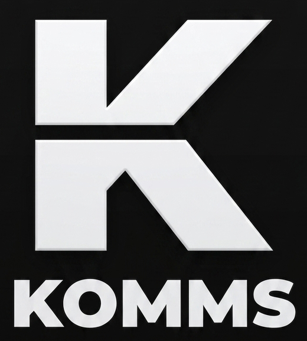

<p align="center">
  
</p>

# Komms

[](https://github.com/AndriGitDev/Komms/actions/workflows/ci.yml)
[](LICENSE)


**Sovereign messaging: end-to-end encrypted, server-independent at its core, and functional on & off the grid.**

*Messages no carrier or optional convenience service can read or scan. The core
needs no provider and works over the internet, commodity LoRa radios, or a USB
stick in a pocket.*

**New here?** Read [Start Here](docs/00-start-here.md): the whole idea in plain words,
no cryptography knowledge required. Then try the demo:

```sh
git clone https://github.com/AndriGitDev/Komms && cd Komms
cargo run --example sneakernet_demo
```

## Current implementation status

Komms is an alpha built from source, not yet a packaged stable release. The
current repository contains the complete server-independent messaging core and
all three application shells:

| Area | Current state |
|---|---|
| **Core and internet/LAN delivery** | M0–M3 are complete: hybrid PQXDH, Double Ratchet, sealed envelopes, encrypted storage, sneakernet, libp2p QUIC/TCP, Kademlia discovery, volunteer mailboxes, NAT traversal, mDNS, `kult-node`, `kultd`, local RPC, CLI, and UniFFI. |
| **Off-grid delivery** | The M4 Meshtastic carrier, duty-cycle enforcement, selective retransmission, and token-blind internet↔mesh bridge are implemented and tested. The physical two-radio nightly bench still needs to be stood up. |
| **Applications** | Tauri desktop, Kotlin Android, and SwiftUI iOS alpha shells build from source over the same embedded runtime. CI exercises the shared behavior layers, real Android APK assembly, and the gated iOS simulator build. Installers/store distribution and hands-on device qualification remain. |
| **Messaging features** | Pairwise and sender-key group text, authenticated immutable message edits with inspectable version history, disappearing text, view-once attachments, fixed-electorate group polls, note-to-self, scheduled text, attachments, recorded audio, still-image editing, group mentions, and B9 safe text formatting are shipped through the shared APIs and all three shells. Poll votes and voter identities are visible to members—not anonymous—and converge under offline reorder before creator snapshot closure. C4 uses exact local deadlines, coarse authenticated relay deletion hints, terminal tombstones, and KKR5 backup exclusion without promising remote erasure or screenshot prevention. Edits converge without rewriting originals; formatting remains inert. Delivery state remains the honest `queued → sent → delivered` ladder. |
| **Attachment safety** | C1 safe file presentation is shipped over the unchanged sealed F3/F4 pipeline. Sender filenames/types remain untrusted hints; mismatched, active, unknown, or nameless files are export-only, recognized external opening is explicit and warns that no malware scan is promised, and no file auto-opens or creates mesh airtime. |
| **Private contact names** | B5 contact rename is shipped across node, RPC/CLI, UniFFI, desktop, Android, and iOS. Petnames are NFC-normalized, duplicate-capable private local labels; spoofing-risk warnings require explicit review, exact peer keys remain authoritative, and rename creates no protocol or transport work. Optional signed self-display suggestions remain deferred. |
| **Private local organization** | B10 folders, B11 conversation pins, and B18 contact/conversation labels are shipped across storage, node, RPC/CLI, UniFFI, desktop, Android, and iOS. They remain sealed local metadata, compose as folder → labels → pins/activity, create zero transport work, and are preserved by `KKR5`. Message pins and message labels remain separate work. |
| **Appearance and accessibility** | B12 system/light/dark appearance is shipped across the sealed F5 preference, node, RPC/CLI, UniFFI, desktop, Android, and iOS. Native system changes apply live, semantic palettes meet the shared WCAG targets, high-contrast/reduced-motion preferences remain native, and security/delivery meaning always retains text or icon cues. |
| **Private custom icons** | B13 contact, group, folder, and note-to-self icons are shipped across the sealed F5 record, node, RPC/CLI, UniFFI, desktop, Android, and iOS. Generated initials are the safe fallback; eight bundled glyphs or selected local JPEG/PNG inputs become strict metadata-free 256×256 PNGs under per-icon/count/aggregate quotas. `KKR5` is the only portability path and icons create zero remote lookup, peer sync, notification, or transport work. |
| **Screen security** | B14 is shipped as an always-on pre-unlock policy across the shared capability contract, RPC/CLI, UniFFI, and every shell. Android applies `FLAG_SECURE` to every activity; iOS obscures inactive/app-switcher and live-captured scenes without claiming universal screenshot blocking; desktop requests best-effort native content protection, shields on focus loss, and locks immediately with `Ctrl/Cmd+Shift+L`. OS, compositor, privileged-software, and external-camera limits remain explicit. |
| **Input privacy** | B15 is shipped as an always-on pre-unlock policy across the shared capability contract, RPC/CLI, UniFFI, and every textual field. Android requests `IME_FLAG_NO_PERSONALIZED_LEARNING` and no suggestions; iOS disables correction and uses secure passphrase/mnemonic fields; desktop disables webview autocomplete, correction, capitalization, and spellcheck. Keyboard, OS, webview, and writing-tool limits remain explicit. |
| **Optional mobile convenience** | ADR-0017 through ADR-0019 propose reversible post-pairing rendezvous and content-free native wake. The layer is design-only: no optional service is implemented or required by the sovereign core. |

Older `KKR1` through `KKR4` backups remain restorable; current backups are
`KKR5`. KKR5 excludes live ephemeral plaintext/media and carries terminal
tombstones so restore cannot resurrect removed content. The principal release gaps are the physical radio bench, hands-on mobile
qualification, reproducible/store distribution work, broader M6 hardening, and
an external security audit. See the [roadmap](docs/08-roadmap.md) for engineering
milestones and the [feature delivery plan](docs/12-feature-delivery-plan.md) for
the product backlog.

Komms is a decentralized messenger built on four principles:

1. **No mandatory middle.** No account or project-operated service is required
   to communicate. Peers talk directly, via volunteer relays holding only sealed
   ciphertext, or over radio. Optional rendezvous and native-wake services may
   improve convenience, but they receive no message plaintext or identity keys
   and their loss never disables the core.
2. **Cryptography at the state of the art.** Hybrid post-quantum key agreement
   (X25519 + ML-KEM-768), Double Ratchet sessions with encrypted headers, and
   XChaCha20-Poly1305 everywhere, assembled strictly from published, audited designs.
3. **Off-grid is a first-class citizen.** When networks are down or shut off, the same
   sealed messages travel over commodity Meshtastic LoRa radios (kilometers of range,
   multi-hop, ~€30 hardware), local links, or `.kkb` file sneakernet.
4. **Your keys, your data, your hardware.** Identity is a keypair you mint yourself: no
   phone number, no email. History is stored locally, encrypted, exportable, and
   deletable for real.

Why this project exists, including its answer to the EU's ChatControl regime, is set
out plainly in [Why Komms](docs/01-why.md).

## Design documents

| Doc | Contents |
|---|---|
| [00: Start Here](docs/00-start-here.md) | The whole project in plain words, for any knowledge level |
| [01: Why](docs/01-why.md) | Motivation, position, commitments |
| [02: Threat Model](docs/02-threat-model.md) | Adversaries, security goals, honest limits |
| [03: Architecture](docs/03-architecture.md) | Layers, crates, message lifecycle, store-and-forward |
| [04: Cryptography](docs/04-cryptography.md) | Normative crypto spec: PQXDH, Double Ratchet, envelopes |
| [05: Transports](docs/05-transports.md) | Internet (libp2p), proximity, Meshtastic/LoRa, sneakernet |
| [06: Identity & Trust](docs/06-identity-trust.md) | Keypair identity, verification, petnames |
| [07: Storage](docs/07-storage.md) | Local-first encrypted storage, backup, portability |
| [08: Roadmap](docs/08-roadmap.md) | Milestones M0–M6 with acceptance criteria |
| [09: Implementation Guide](docs/09-implementation-guide.md) | Build order, API sketches, standards, review gates |
| [10: HIL Bench](docs/10-hil-bench.md) | Hardware-in-loop nightly: two-radio bench runbook |
| [11: Feature Scope](docs/11-feature-scope.md) | Which product features fit the model, and under what constraints |
| [12: Feature Delivery Plan](docs/12-feature-delivery-plan.md) | Sequenced implementation plan for every approved product feature |
| [13: Screen Security](docs/13-screen-security.md) | B14 platform guarantees, limitations, behavior, and qualification matrix |
| [14: Incognito Keyboard](docs/14-incognito-keyboard.md) | B15 input-field guarantees, native controls, honest limits, and qualification matrix |
| [15: Private Contact Names](docs/15-contact-petnames.md) | B5 local petname rename contract, warnings, privacy boundary, and qualification matrix |
| [16: Safe Text Formatting](docs/16-safe-text-formatting.md) | B9 source subset, active-content boundary, limits, compatibility, and qualification matrix |
| [17: Safe File Presentation](docs/17-safe-file-presentation.md) | C1 filename/type policy, open/export boundary, lifecycle, and qualification matrix |
| [18: Authenticated Message Editing](docs/18-message-editing.md) | C3 immutable edit events, authorship, convergence, retained versions, compatibility, and qualification |
| [19: Disappearing Messages and View-Once Attachments](docs/19-ephemeral-messages.md) | C4 exact local expiry, coarse relay retention, tombstones, KKR5 exclusion, honest limits, and qualification |
| [ADRs](docs/adr/README.md) | Decision index, status, and the alternatives each decision beat |

## Stack

Rust workspace (`kult-crypto` / `kult-protocol` / `kult-transport` / `kult-store` /
`kult-node` / `kultd` / `kult-ffi`), UniFFI bindings, Tauri desktop app, native
mobile shells.
Layout in [Architecture §7](docs/03-architecture.md). Implemented so far:
`kult-crypto` (hybrid PQXDH, Double Ratchet with encrypted headers, anonymous sealed
boxes, sealed state, sender-key group chains), `kult-protocol` (envelopes, padding
buckets, fragmentation + NACKs, delivery tokens, sealed group headers, `.kkb`
bundles), and `kult-store` (encrypted SQLite, key
hierarchy, persistent queue), `kult-transport` (the `Transport` contract, the
sneakernet spool-directory carrier, and the libp2p internet carrier: QUIC primary,
TCP+Noise+Yamux fallback, envelope request-response protocol with honest next-hop
acks, a Kademlia discovery plane serving signed prekey-bundle records, volunteer
mailbox relays storing only sealed envelopes, and NAT traversal via AutoNAT +
Circuit Relay v2 + DCUtR), and `kult-node` (session lifecycle, delivery
engine with per-message state machine and retry/backoff, transport scheduler
with mesh priority classes and the 4 KiB airtime ceiling, end-to-end
encrypted delivery receipts, fragmentation over small-MTU links with
selective-retransmission NACKs, contact-by-address via DHT lookup,
command/event API), and `kultd` (headless
daemon: tick loop, DHT bootstrap + bundle publication, automatic NAT/relay
lifecycle, mailbox check-ins, local JSON RPC over a Unix socket, `kult` CLI),
and `kult-ffi` (UniFFI bindings: the node's command/event API as typed
records/enums with an embedded in-process runtime, for the application shells),
plus `apps/desktop` (Tauri shell), `apps/android`
(Kotlin alpha shell over the generated bindings), and `apps/ios`
(SwiftUI alpha shell over the same bindings).

```sh
cargo test --workspace          # KATs, property tests, 10k-message soak
cargo build -p kult-crypto --no-default-features   # no_std build
cd crates/kult-crypto && cargo +nightly fuzz run envelope_decode -- -max_total_time=60
```

## Contributing

Security review, hands-on platform testing, and focused implementation of the
remaining roadmap are especially valuable; see [CONTRIBUTING.md](CONTRIBUTING.md).
Security issues: [SECURITY.md](SECURITY.md).

## License

[AGPLv3](LICENSE). Anyone may run, study, modify, and share every component, and
modified network services must publish their source. Rationale:
[ADR-0006](docs/adr/0006-agplv3.md).
