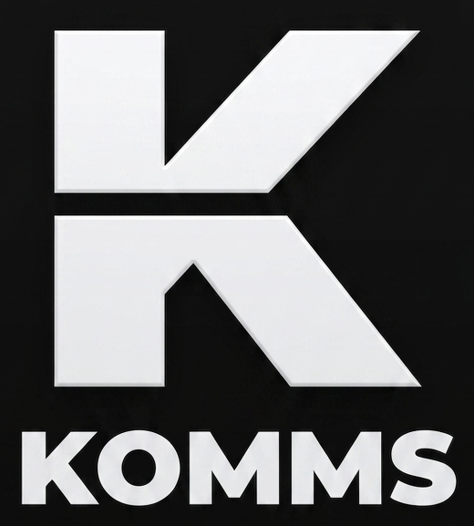
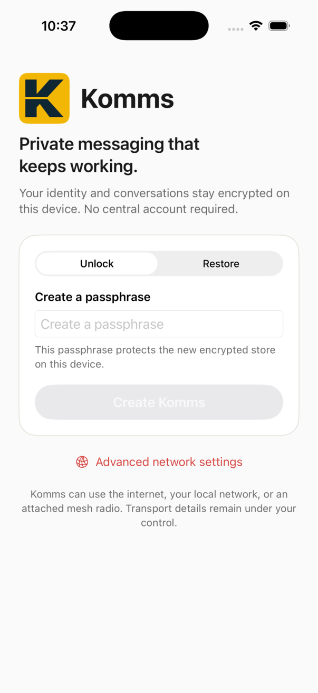
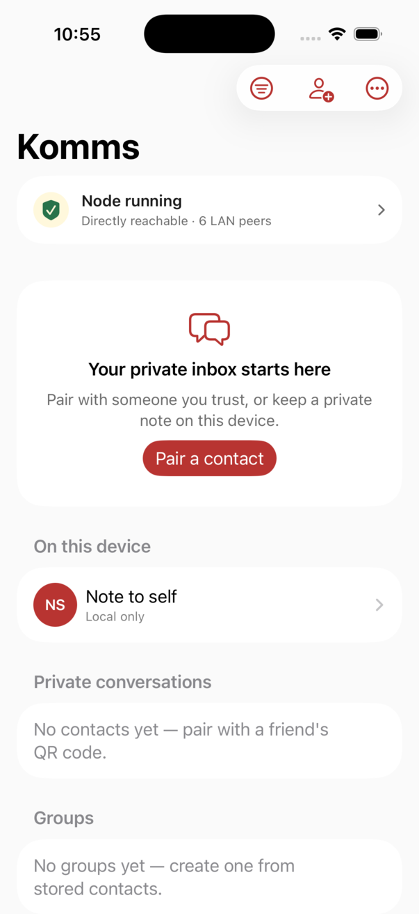

<p align="center">
  
</p>

# Komms

[](https://github.com/AndriGitDev/Komms/actions/workflows/ci.yml)
[](LICENSE)


**Private messaging that keeps working.**

*Komms aims to make ordinary conversations feel familiar while user-owned
identity, strong end-to-end encryption, and resilient internet, local, radio,
and sneakernet paths stay underneath. Its pure core has no mandatory exclusive
provider. A future Standard mode may offer replaceable optional defaults for
easy first use; those services must never receive message plaintext or identity
private keys belonging to Komms users.*

Komms has a nonprofit public-benefit mission: private, resilient communication
should be useful to ordinary people without surveillance or exclusive-provider
lock-in. The project is founder-directed, and accountability remains with the
human maintainer.

**New here?** Read [Start Here](docs/00-start-here.md): the whole idea in plain
words, with no cryptography knowledge required.

## Komms 0.3 interface preview

<p align="center">
  
  &nbsp;&nbsp;
  
</p>

<p align="center"><em>The Komms 0.3 Alpha interface. Android, iOS, and desktop share the same brand and conversation-first information hierarchy.</em></p>

## Install 0.3 Alpha for testing

Open the public
[Komms 0.3 Alpha release](https://github.com/AndriGitDev/Komms/releases/tag/v0.3.0)
and download one package:

| System | Choose |
|---|---|
| Windows 10/11 x64 | `.msi` or `-setup.exe` |
| macOS Intel or Apple silicon | universal `.dmg` |
| Linux x86-64 | `.AppImage`, `.deb`, or `.rpm` |
| Android 8.0+ | `-android-debug.apk` |

Download `SHA256SUMS` too. These are unsigned/debug-signed Alpha packages, so
verify the download before accepting an operating-system warning. The
[Alpha testing guide](docs/27-alpha-testing.md) has exact verification,
installation, first-test, and issue-reporting steps. No source build is
required. iOS currently remains source/Simulator-only.

## What changed in 0.3 Alpha

- **Pairing that phone cameras can actually scan.** Post-quantum bundle sharing
  now uses compact Base45 payloads and a bounded animated QR sequence on
  desktop. Frames assemble in any order, and legacy bundle QRs and pasted hex
  remain accepted.
- **Fresh messages stay responsive.** New user actions bypass passive queue
  maintenance. Unreachable sealed messages retry in the background and become
  an honest `delivery failed after 30 days` entry if no encrypted receipt
  arrives.
- **A genuinely shared interface.** Android now carries the same branded,
  conversation-first hierarchy already approved on iOS and desktop. Settings
  keeps backup, linked-device, network, and diagnostic controls out of the
  everyday path.
- **Clearer identity and discovery.** Safety numbers are 30 readable digits
  while QR verification retains the full 256-bit comparison. Desktop sharing,
  contact rename, DHT/mDNS status, and conversation rendering are hardened.
- **Four-platform preview evidence.** Android and iOS simulators plus local
  macOS and Linux desktop previews now require explicit visual approval. Linux
  desktop launch smoke also runs in CI and in the release workflow. This is not
  physical-device or stable-platform qualification.
- **A release-shaped self-hosted node.** The public `kultd` image is prepared
  for Linux amd64 and arm64 with provenance, an SBOM, and immutable `0.3.0`
  tagging.

## Current implementation status

Komms 0.3 Alpha is a public prerelease for testing, not an independently
audited or stable release. The repository contains a broad implemented core and
three application shells, with substantial automated evidence. Simulator
builds and self-round-trip tests are not physical-device qualification or
independent interoperability.

| Area | Current state |
|---|---|
| **Core security and storage** | Hybrid PQXDH, Double Ratchet sessions, sealed envelopes, opaque keyed SQLite indexes, row-bound local records, released-schema migration, backup/recovery, RPC/CLI, and UniFFI paths are implemented with repeatable tests. SQLite still reveals approximate row counts/sizes, order, within-domain equality, access patterns, and change timing. Storage has Linux/ext4 test evidence, but independent review and physical macOS, Windows, Android, iOS, power-loss, backup-exclusion, and forensic qualification remain open. |
| **Internet, LAN, and delayed delivery** | libp2p QUIC/TCP, Kademlia discovery, NAT traversal, mDNS, and volunteer mailbox roles are implemented. Fresh app installs do not yet have a qualified distinct-NAT golden path: bootstrap and mailbox defaults require deliberate configuration, and mailbox persistence/operator behavior remains a stabilization gate. [ADR-0034](docs/adr/0034-operator-minimized-reference-discovery.md) proposes an initial founder-operated Hetzner Standard-mode bootstrap/DHT/rendezvous default with RAM-backed mutable state; it is not implemented or a durable mailbox. |
| **Off-grid delivery** | Sneakernet and the Meshtastic carrier, duty-cycle controls, retransmission, and internet↔mesh bridge paths are implemented with automated evidence. The physical two-radio bench is not yet field-qualified. |
| **Applications and messaging** | Desktop, Android, and iOS shells expose pairwise/group text and a broad Alpha feature set, including attachments, local organization, linked devices, ephemeral content, polls, roles, and direct audio-call paths. CI and simulator evidence exist; hands-on device, background lifecycle, NAT, accessibility, and localization qualification remain. |
| **Distribution** | Unsigned desktop packages and a debug-signed Android APK are published for Alpha testing; iOS is source/Simulator-only. Production signing, authenticated updates, reproducibility measurements, store distribution, upgrade/rollback qualification, and stable support are not configured. |
| **Optional mobile convenience** | ADR-0017 through ADR-0019 propose reversible post-pairing rendezvous and content-free native wake. The layer is design-only: no optional service is implemented or required by the sovereign core. |
| **Trust and governance** | The project is founder-directed by design during construction and stabilization under a nonprofit public-benefit mission. The founder retains product and release authority. Independent security and interoperability evidence is still missing. The [stabilization program](docs/29-stabilization-program.md) defines the evidence required before stable claims. |

Older `KKR1` through legacy copied-root `KKR7` backups remain explicit
migration/reset inputs: they never resume the former account, and the guided
flow publishes a fresh identity containing only cleared petnames, accurately
labelled non-ephemeral pairwise history, notes, and eligible local
organization. They are decode-only compatibility formats: production APIs
cannot mint or publish a new copied-root backup. Current routine backups are
root-free `KKR8`. KKR6
added signed group authority state, KKR7 added the former linked-device
authority/convergence layout, and KKR8 carries eligible user state plus the
accepted offline-root authority proof without any account root or reusable
device, ratchet, prekey, sender-chain, link, or delivery-resumption secret.
Stable-identity `KKR8` restore requires the separately held offline
recovery-authority file and phrase, creates one fresh recovery device, and
rejects descendants of the old epoch. Current backups also exclude live
ephemeral plaintext/media and carry
terminal tombstones so restore does not recreate those records in Komms. This
is local implementation evidence, not a promise to erase copies retained by
peers, screenshots, exported backups, or compromised endpoints.

The [stabilization program](docs/29-stabilization-program.md) now takes priority
over feature expansion. It defines exact evidence levels, owners, P0/P1/P2
gates, and the first 90 days. The [roadmap](docs/08-roadmap.md) remains the
engineering inventory, the [feature delivery plan](docs/12-feature-delivery-plan.md)
remains the product backlog, and the
[local release gate](docs/24-local-release-gate.md) describes existing build
checks. The [stable-v1 product profile](docs/30-stable-v1-product-profile.md)
freezes the release target, the
[release evidence ledger](docs/31-release-evidence-ledger.md) records every P0
gate and stable claim, and the
[name-risk decision](docs/32-name-risk-decision.md) records the founder's
keep-and-monitor decision without claiming legal clearance.

Komms is built on four principles:

1. **Everyday messenger first.** Installation, pairing, sending, recovery, and
   delivery state should make sense without transport or cryptography knowledge.
2. **No mandatory exclusive provider.** Peers may communicate directly, through
   chosen volunteer mailbox operators holding sealed ciphertext, or over local,
   radio, and sneakernet paths. Standard mode may use disclosed, replaceable
   defaults. Optional rendezvous and native wake receive no message plaintext or
   identity private keys and remain removable.
3. **Strong cryptographic building blocks, honestly qualified.** The
   implementation combines published constructions including X25519 +
   ML-KEM-768, Double Ratchet sessions with encrypted headers, and
   XChaCha20-Poly1305. That combination still requires independent review and
   interoperability evidence before it can be called audited or stable.
4. **Your keys and local data stay yours.** Identity needs no phone number or
   email. Komms can delete its local encrypted history and exclude expiring
   content from its own current backups, but it cannot erase copies another
   person, export, screenshot, operating system, or compromised device retains.

[Why Komms](docs/01-why.md) explains the social motivation, including concern
about policy proposals and laws that seek or allow private communications to be
scanned. It distinguishes that position from claims about the current legal
status of any particular proposal.

## Design documents

| Doc | Contents |
|---|---|
| [00: Start Here](docs/00-start-here.md) | The whole project in plain words, for any knowledge level |
| [01: Why](docs/01-why.md) | Motivation, position, commitments |
| [02: Threat Model](docs/02-threat-model.md) | Adversaries, security goals, honest limits |
| [03: Architecture](docs/03-architecture.md) | Layers, crates, message lifecycle, store-and-forward |
| [04: Cryptography](docs/04-cryptography.md) | Normative crypto spec: PQXDH, Double Ratchet, envelopes |
| [05: Transports](docs/05-transports.md) | Internet (libp2p), proximity, Meshtastic/LoRa, sneakernet |
| [06: Identity & Trust](docs/06-identity-trust.md) | Keypair identity, verification, petnames |
| [07: Storage](docs/07-storage.md) | Local-first encrypted storage, backup, portability |
| [08: Roadmap](docs/08-roadmap.md) | Milestones M0–M6 with acceptance criteria |
| [09: Implementation Guide](docs/09-implementation-guide.md) | Build order, API sketches, standards, review gates |
| [10: HIL Bench](docs/10-hil-bench.md) | Hardware-in-loop nightly: two-radio bench runbook |
| [11: Feature Scope](docs/11-feature-scope.md) | Which product features fit the model, and under what constraints |
| [12: Feature Delivery Plan](docs/12-feature-delivery-plan.md) | Sequenced implementation plan for every approved product feature |
| [13: Screen Security](docs/13-screen-security.md) | B14 platform guarantees, limitations, behavior, and qualification matrix |
| [14: Incognito Keyboard](docs/14-incognito-keyboard.md) | B15 input-field guarantees, native controls, honest limits, and qualification matrix |
| [15: Private Contact Names](docs/15-contact-petnames.md) | B5 local petname rename contract, warnings, privacy boundary, and qualification matrix |
| [16: Safe Text Formatting](docs/16-safe-text-formatting.md) | B9 source subset, active-content boundary, limits, compatibility, and qualification matrix |
| [17: Safe File Presentation](docs/17-safe-file-presentation.md) | C1 filename/type policy, open/export boundary, lifecycle, and qualification matrix |
| [18: Authenticated Message Editing](docs/18-message-editing.md) | C3 immutable edit events, pairwise and recipient-authenticated group authorship, convergence, retained versions, compatibility, and qualification |
| [19: Disappearing Messages and View-Once Attachments](docs/19-ephemeral-messages.md) | C4 exact local expiry, coarse relay retention, tombstones, KKR8 exclusion, honest limits, and qualification |
| [20: Group Polls](docs/20-group-polls.md) | C5 visible recipient-authenticated votes, fixed electorate, deterministic convergence, creator closure, and qualification |
| [21: Group Roles, Ownership, and Moderation](docs/21-group-roles.md) | C6 signed owner/admin/member authority, transfer, rotation, moderation, backup, and qualification |
| [22: Linked Devices](docs/22-linked-devices.md) | C2 strict-majority device authority, confirmed linking, per-device delivery, sync, offline recovery, revocation, and honest Alpha migration |
| [23: Live Audio Calls](docs/23-live-audio-calls.md) | C7 direct-QUIC gating, transient signaling, authenticated Opus media, platform behavior, privacy limits, and qualification |
| [24: Local Release Gate](docs/24-local-release-gate.md) | Toolchains, complete local validation, CI/advisory evidence, SDK deferrals, signing boundary, and publication discipline |
| [25: Release Runbook](docs/25-release-runbook.md) | Versioning, native desktop/APK artifact builds, signing inputs, qualification, and explicit publication |
| [26: Self-hosting](docs/26-self-hosting.md) | Hardened Docker Compose deployment, ports, secret initialization, node modes, and Alpha limits |
| [27: Alpha Testing](docs/27-alpha-testing.md) | Download verification, installation, smoke testing, issue reporting, and self-hosted image quick start |
| [28: Brand System](docs/28-brand-system.md) | Cross-shell product character, tokens, hierarchy, and pragmatic name-risk monitoring |
| [29: Stabilization Program](docs/29-stabilization-program.md) | Canonical evidence vocabulary, trust gates, owners, and 90-day sequence |
| [30: Stable-v1 Product Profile](docs/30-stable-v1-product-profile.md) | Frozen install, messaging, bounds, recovery, delivery, platform, service, and exclusion contract |
| [31: Release Evidence Ledger](docs/31-release-evidence-ledger.md) | P0 and stable-claim owners, evidence, revisions, gaps, and review dates |
| [32: Name-risk Decision](docs/32-name-risk-decision.md) | Dated keep-and-monitor decision, observed overlap, migration cost, cadence, and advice triggers |
| [ADRs](docs/adr/README.md) | Decision index, status, and the alternatives each decision beat |

## Stack

Rust workspace (`kult-crypto` / `kult-protocol` / `kult-transport` / `kult-store` /
`kult-node` / `kultd` / `kult-ffi`), UniFFI bindings, Tauri desktop app, native
mobile shells.
Layout in [Architecture §7](docs/03-architecture.md). Implemented so far:
`kult-crypto` (hybrid PQXDH, Double Ratchet with encrypted headers,
sender-anonymous sealed envelopes, sealed state, sender-key group chains),
`kult-protocol` (envelopes, padding
buckets, fragmentation + NACKs, delivery tokens, sealed group headers, `.kkb`
bundles), and `kult-store` (encrypted SQLite, key
hierarchy, persistent queue), `kult-transport` (the `Transport` contract, the
sneakernet spool-directory carrier, and the libp2p internet carrier: QUIC primary,
TCP+Noise+Yamux fallback, envelope request-response protocol with honest next-hop
acks, a Kademlia discovery plane serving signed prekey-bundle records, volunteer
mailbox relays storing only sealed envelopes, and NAT traversal via AutoNAT +
Circuit Relay v2 + DCUtR), and `kult-node` (session lifecycle, delivery
engine with per-message state machine and retry/backoff, transport scheduler
with mesh priority classes and the 4 KiB airtime ceiling, end-to-end
encrypted delivery receipts, fragmentation over small-MTU links with
selective-retransmission NACKs, contact-by-address via DHT lookup,
command/event API), and `kultd` (headless
daemon: tick loop, DHT bootstrap + bundle publication, automatic NAT/relay
lifecycle, mailbox check-ins, local JSON RPC over a Unix socket, `kult` CLI),
and `kult-ffi` (UniFFI bindings: the node's command/event API as typed
records/enums with an embedded in-process runtime, for the application shells),
plus `apps/desktop` (Tauri shell), `apps/android`
(Kotlin alpha shell over the generated bindings), and `apps/ios`
(SwiftUI alpha shell over the same bindings). The daemon writes structured,
content-free diagnostics to stderr (`RUST_LOG`, default `info`) and supports
owner-only passphrase/mnemonic files for service deployment; run `kultd --help`
for the complete operator surface.

## Build and validation

Rust **1.88 or newer** is required by the locked dependency graph and verified
as the minimum supported Rust version in CI. A current stable toolchain is the
normal developer choice; the complete fuzz gate additionally needs nightly
Rust and `cargo-fuzz`. Platform SDK requirements live in the
[desktop](apps/desktop/README.md), [Android](apps/android/README.md), and
[iOS](apps/ios/README.md) guides.

```sh
cargo test --workspace --all-features          # KATs, properties, e2e, soak
cargo build -p kult-crypto --no-default-features   # no_std build
cd crates/kult-crypto && cargo +nightly fuzz run envelope_decode -- -max_total_time=60
```

Before a publication candidate, run `scripts/local-release-matrix.sh` from the
repository root and record every explicit `DEFERRED` platform gate. The exact
division between local checks, per-push CI, weekly advisory evidence, physical
qualification, and signing is documented in the
[local release gate](docs/24-local-release-gate.md).

The **Komms 0.3 Alpha** prerelease is built from tag `v0.3.0` on native Windows,
macOS, Linux, and Android runners. Install it using the
[Alpha testing guide](docs/27-alpha-testing.md). Its public Linux amd64/arm64
self-hosting image is available as the immutable
`ghcr.io/andrigitdev/komms-kultd:0.3.0` tag and the `0.3-alpha`/`alpha` aliases. See the
[release runbook](docs/25-release-runbook.md) for the version bump,
APK/installer/container, signing, checksum, smoke-test, and publication process,
or the [self-hosting guide](docs/26-self-hosting.md) to run `kultd`.

## Contributing

Security review, hands-on platform testing, and focused implementation of the
remaining roadmap are especially valuable; see [CONTRIBUTING.md](CONTRIBUTING.md).
Project decisions and ownership: [GOVERNANCE.md](GOVERNANCE.md) and
[MAINTAINERS.md](MAINTAINERS.md). Security issues: [SECURITY.md](SECURITY.md).
Participation follows the [Code of Conduct](CODE_OF_CONDUCT.md).

## License

Komms software is licensed under [AGPL-3.0-only](LICENSE). Under AGPLv3 section
13, a modified covered version that supports remote network interaction must
prominently offer its remote users an opportunity to receive that version's
Corresponding Source. The AGPL permits commercial use; Komms's nonprofit
mission governs official project activity, not independent licensees. See
[ADR-0006](docs/adr/0006-agplv3.md) and
[ADR-0033](docs/adr/0033-nonprofit-founder-stewardship.md). This summary is not
legal advice.
