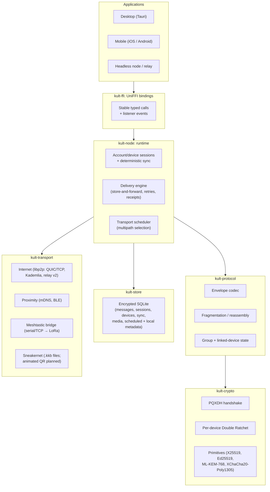

# 03: Architecture

Komms is a **local-first, server-independent** messaging system. Every
installation is a full peer: it holds its own keys, stores its own history, and
can relay for others. No component that carries or stores messages must be
operated by the project or any single party. Optional post-pairing rendezvous
and native-wake services may accelerate mobile reachability under ADR-0017, but
they are neither message transports nor dependencies of the core.

The internal Rust crates use the `kult-*` prefix. **KULT** expands to **Komms
Ubiquitous Link Transmission**: the shared system that carries one protected
conversation across applications, cryptography, storage, and interchangeable
online or off-grid links.

## 1. Layer model



**Dependency rule**: arrows only point downward. `kult-crypto` depends on nothing but
primitive crates; `kult-transport` never sees plaintext; `kult-store` never sees the
network. This makes the crypto core auditable in isolation and keeps the trusted computing
base small.

## 2. Crate responsibilities

| Crate | Owns | Must never |
|---|---|---|
| `kult-crypto` | Account/device key generation, certificates and manifests, PQXDH, Double Ratchet, sync sealing, AEAD, fingerprints. Pure functions + opaque state objects; `#![forbid(unsafe_code)]`; all secrets `zeroize`-on-drop. | Perform I/O of any kind. |
| `kult-protocol` | Envelope wire format, fragmentation for small-MTU links, sender-key group fan-out, bounded linked-device bundles/events, padding. | Touch key material directly (only via `kult-crypto` handles). |
| `kult-transport` | The `Transport` trait and its implementations; peer discovery; link encryption. | See plaintext or long-term identity secrets. |
| `kult-store` | Encrypted persistence of messages, sessions, contacts, devices, sync convergence, queues, media, scheduled work, backups, and sealed local metadata. | Perform network I/O or transport scheduling. |
| `kult-node` | Composition: account/device lifecycle, per-device delivery, deterministic sync, multipath scheduling, event bus. | Reimplement lower-layer logic. |
| `kult-ffi` | UniFFI-exposed API and embedded runtime for Kotlin, Swift, and shell consumers. | Add behavior beyond `kult-node`. |

B9 formatting is deliberately a pure `kult-node` projection rather than a
protocol or storage layer. Apps pass exact authenticated source plus optional
authenticated semantic ranges and receive bounded block roles and styled text
runs. RPC and UniFFI mirror that model; shells create only inert native text
primitives. Exact source continues through the ordinary lifecycle below, so old
clients, backups, receipts, padding, and carrier selection are unchanged.

C3 editing uses the opposite storage shape while keeping the same layer
boundaries: `kult-protocol` owns canonical content-v1 `Edit`; `kult-node`
authorizes exact author/content references and derives the deterministic winner;
the existing sealed message tables retain immutable originals and edits; RPC and
UniFFI expose only strict identifiers and render-safe history; shells refresh an
exact target on typed edit events. Edits still traverse the ordinary ratchet or
sender-key lane, so no transport can observe the kind and no shell implements
ordering or authorization independently. See
[18: Authenticated Message Editing](18-message-editing.md).

C4 ephemeral content crosses every layer without moving deletion policy into a
shell or relay. `kult-protocol` owns content-v1 kind 5 and envelope v2's coarse
retention field; `kult-node` binds capabilities, exact deadlines, queueing,
expiry-before-work, and terminal events; `kult-store` owns sealed lifecycle rows,
tombstones, media deletion, and KKR6 exclusion; transports only delete sealed
envelopes from the authenticated hour bucket. RPC/UniFFI and apps expose typed
choices and honest local-only language. See
[19: Disappearing Messages and View-Once Attachments](19-ephemeral-messages.md).

C5 polls follow the immutable replicated-state shape: `kult-protocol` owns
content-v1 kind 6 create/vote/close frames; `kult-node` authenticates the group
sender and derives fixed-electorate vote heads and final tallies; existing
sealed group rows and `KKR7` carry the source events; RPC/UniFFI expose typed
snapshots; shells render and refresh cards without resolving votes. The
sender-key path hides poll content from transports, while authenticated
capability intersection keeps old clients off the typed send path. See
[20: Group Polls](20-group-polls.md).

C6 authority adds a deliberately separate signed control plane without moving
policy into shells. `kult-protocol` owns content-v1 kind 7, the canonical full
authority state, owner-transfer certificates, signed admin requests, and signed
poll-moderation closure; `kult-crypto` owns the four identity-signature domains;
`kult-node` validates transfer-chain ancestry and serializes every mutation at
the one current owner; `kult-store` seals the winning state and consumed request
ids separately from legacy group records. RPC/UniFFI expose render-safe roles
and typed commands/events. Apps display roles and invoke those commands but
never see group secrets, signatures, identity blobs, or chain state. `KKR6`
introduced authority records and `KKR7` carries them forward, while
`KKR1`-`KKR5` restore as legacy groups. See
[21: Group Roles, Ownership, and Moderation](21-group-roles.md).

C2 linked devices separate stable account identity from physical endpoint
cryptography. `kult-crypto` owns certificates, manifests, link transcripts, and
sync sealing; `kult-protocol` owns bounded endpoint bundles and sync events;
`kult-store` seals device authority, per-endpoint delivery state, sync counters,
and deterministic winners; `kult-node` enforces fan-out, capability intersection,
revocation, convergence, and recovery. RPC/UniFFI expose opaque ceremony bytes
and strict render-safe device models; shells compare codes and collect explicit
approvals without implementing authority rules. See
[22: Linked Devices](22-linked-devices.md) and
[ADR-0024](adr/0024-account-authorized-linked-devices.md).

## 3. Message lifecycle

### Send path
For a scheduled send, `kult-node` first stores the destination, text, and
absolute UTC `not_before` value in a separately sealed scheduled-outbox row.
Until a tick observes `now >= not_before`, the steps below do not begin: no
ratchet advances and no envelope or transport-visible queue row exists. This is
what makes pre-activation edit/cancel safe. Clock rollback keeps the row held;
clock advance activates it on the next tick; time-zone changes are display-only.

1. **App** calls `send(conversation, content)` through `kult-ffi`.
2. **kult-node** persists the outbound message locally (`kult-store`) with state `queued`:
   the UI is truthful about delivery, and nothing is lost on crash.
3. **kult-protocol** serializes content, pads it to the next size bucket, and hands it to
   the conversation's ratchet.
4. **kult-crypto** advances the sending chain, encrypts with XChaCha20-Poly1305, and
   encrypts the ratchet header.
5. **kult-protocol** wraps ciphertext in a **sealed envelope**. Ordinary v1
   envelopes expose only an opaque per-recipient *delivery token* (see §5).
   Ephemeral envelope v2 additionally exposes one hour-aligned deletion bucket,
   authenticated again inside the encrypted content. If the selected link's MTU is small
   (LoRa ≈ 200 B), the envelope is fragmented.
6. **Transport scheduler** picks the best available transport(s) for this peer, possibly
   several in parallel (internet + mesh). Duplicate delivery is fine: envelopes are
   idempotent by message ID; receivers deduplicate.
7. On receipt of an encrypted delivery receipt, state advances `queued → sent → delivered`.

### Receive path
Mirror image: transport yields envelope → reassembly → dedup by message ID → ratchet
decrypt (tolerating skipped/out-of-order counters within the configured window) → persist →
event to app → (optionally) send encrypted receipt.

### Live-call path

C7 deliberately does not reuse the durable message lifecycle for media. A
bounded `CallControl` offer/answer/decline/busy/cancel/hangup value travels
inside the existing pairwise ratchet, but the node keeps its decoded state
transient and excludes it from history, search, backup, and C2 sync. After one
authorized physical device wins the answer, `kult-transport` opens
`/komms/call/1` only on the observed direct QUIC connection. `kult-crypto`
derives and owns directional per-call media keys plus replay/key-phase state;
the shells exchange only bounded Opus packets and render-safe call status.

TCP, relay-only, mailbox, sneakernet, and airtime-budgeted carriers fail the
availability check before an offer is emitted. This path has no coordinator or
store-and-forward substitute. See [23: Live Audio Calls](23-live-audio-calls.md).

## 4. Store-and-forward without servers

Peers are rarely online at the same moment, especially off-grid. Delivery uses three
mechanisms, in preference order:

1. **Direct**: recipient reachable on some transport now → deliver immediately.
2. **Mailbox relays**: any Komms node may volunteer relay capacity. The sender deposits
   the sealed envelope with one or more relays chosen by the *recipient* (advertised in
   their signed prekey bundle, [06: Identity & Trust](06-identity-trust.md)). Relays store
   ciphertext-only, TTL-bounded, size-capped queues keyed by delivery token. Users
   naturally relay for their own contacts (friend-relay model); public volunteer relays are
   additive, never required.
3. **Mesh flooding / sneakernet**: on Meshtastic, envelopes propagate hop-by-hop with the
   mesh's own store-and-forward; any node that later gains internet can bridge queued
   envelopes onward. Fully offline, envelopes export as `.kkb` files; animated
   message-bundle QR remains planned.

A message may traverse all three; deduplication makes redundancy safe and encouraged.

### 4.1 Optional reachability and wake acceleration

[ADR-0017](adr/0017-optional-hybrid-modes.md) defines Sovereign, Private, and
Standard modes over the same core. In the optional modes:

1. [ADR-0018](adr/0018-pairwise-rendezvous.md) stores a fixed-size encrypted
   route record under rotating provider- and direction-specific pairwise slots.
   It supplements post-pairing hints; it never replaces signed DHT/QR first
   contact or a mailbox.
2. [ADR-0019](adr/0019-native-wake-gateway.md) lets a sender present a bounded
   per-contact capability after a direct peer or mailbox accepted the sealed
   envelope. APNs/FCM receives a static wake shape and no conversation data.
3. `kult-node` merges source-scoped expiring hints, lets F4 probe them, and runs
   one bounded generic collection cycle on wake. Optional-service responses do
   not authenticate peers or change message delivery state.

Pure derivation and record sealing remain in `kult-crypto`; bounded encodings
remain in `kult-protocol`; I/O adapters receive only opaque requests in
`kult-transport`; orchestration remains in `kult-node`. Rendezvous and wake
server binaries are outside the client dependency graph. Blackholing every such
server must reproduce Sovereign-mode behavior without migration or data loss.

## 5. What intermediaries see

A relay, DHT node, or mesh repeater carrying ordinary Komms envelopes observes only:

- an opaque, rotating **delivery token** (unlinkable to the recipient's identity key by
  anyone but the recipient and, per-message, the sender),
- a padded ciphertext in one of a small set of standard size buckets,
- transport-level source of the immediately preceding hop (unavoidable at layer 4).

For C4 ephemeral traffic, the carrier additionally observes one coarse,
hour-aligned `retention_until` bucket so it can delete sealed work without
decrypting it. The exact deadline and whether the content is text or view-once
media remain encrypted. The bucket is a bounded deletion hint, not proof that a
relay erased every copy.

No sender identity, no recipient identity, no exact content deadline beyond arrival time, no
conversation linkage. This is the **sealed sender** property; the construction is specified
in [04: Cryptography §7](04-cryptography.md).

This paragraph does not describe an enabled optional rendezvous or native-wake
service. Their bounded but non-zero metadata surfaces are listed in
[02: Threat Model](02-threat-model.md) and ADR-0017.

## 6. Groups

v1 groups use **sender keys**: each member maintains a per-group sending chain, announced
to members over existing pairwise ratchet sessions; a group message is encrypted once and
fanned out. Membership changes re-key. This is efficient over constrained links (one
ciphertext, not N) and adequate for small-to-medium groups. Large-group semantics (MLS,
RFC 9420) are a documented later milestone; see decision record
[ADR-0003](adr/0003-double-ratchet-pqxdh.md) and [08: Roadmap](08-roadmap.md).

## 7. Repository layout

```
komms/
├── Cargo.toml            # workspace
├── crates/
│   ├── kult-crypto/
│   ├── kult-protocol/
│   ├── kult-transport/
│   ├── kult-store/
│   ├── kult-node/
│   ├── kult-ffi/
│   └── kultd/             # daemon + CLI
├── apps/
│   ├── desktop/          # Tauri (M5)
│   ├── android/          # Kotlin shell over kult-ffi (M5)
│   └── ios/              # Swift shell over kult-ffi (M5)
└── docs/                 # this documentation
```

Build order and per-crate API sketches for implementers:
[09: Implementation Guide](09-implementation-guide.md).
