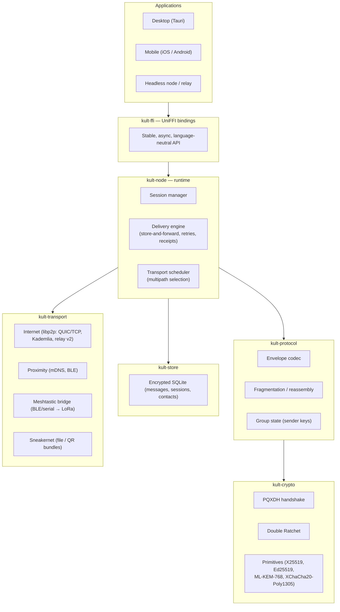

# 03 — Architecture

KommsKult is a **local-first, serverless** messaging system. Every installation is a full
peer: it holds its own keys, stores its own history, and can relay for others. There is no
component in the system that must be operated by the project or any single party.

## 1. Layer model



**Dependency rule**: arrows only point downward. `kult-crypto` depends on nothing but
primitive crates; `kult-transport` never sees plaintext; `kult-store` never sees the
network. This makes the crypto core auditable in isolation and keeps the trusted computing
base small.

## 2. Crate responsibilities

| Crate | Owns | Must never |
|---|---|---|
| `kult-crypto` | Key generation, PQXDH, Double Ratchet, AEAD, fingerprints. Pure functions + opaque state objects; `#![forbid(unsafe_code)]`; all secrets `zeroize`-on-drop. | Perform I/O of any kind. |
| `kult-protocol` | Envelope wire format, fragmentation for small-MTU links, sender-key group fan-out, padding. | Touch key material directly (only via `kult-crypto` handles). |
| `kult-transport` | The `Transport` trait and its implementations; peer discovery; link encryption. | See plaintext or long-term identity secrets. |
| `kult-store` | Encrypted persistence of messages, sessions, contacts, queues. | Interpret protocol semantics. |
| `kult-node` | Composition: session lifecycle, delivery engine, multipath scheduling, event bus. | Reimplement lower-layer logic. |
| `kult-ffi` | UniFFI-exposed API for Kotlin/Swift/TS consumers. | Add behavior beyond `kult-node`. |

## 3. Message lifecycle

### Send path
1. **App** calls `send(conversation, content)` through `kult-ffi`.
2. **kult-node** persists the outbound message locally (`kult-store`) with state `queued`
   — the UI is truthful about delivery, and nothing is lost on crash.
3. **kult-protocol** serializes content, pads it to the next size bucket, and hands it to
   the conversation's ratchet.
4. **kult-crypto** advances the sending chain, encrypts with XChaCha20-Poly1305, and
   encrypts the ratchet header.
5. **kult-protocol** wraps ciphertext in a **sealed envelope**: the only cleartext field is
   an opaque per-recipient *delivery token* (see §5). If the selected link's MTU is small
   (LoRa ≈ 200 B), the envelope is fragmented.
6. **Transport scheduler** picks the best available transport(s) for this peer — possibly
   several in parallel (internet + mesh). Duplicate delivery is fine: envelopes are
   idempotent by message ID; receivers deduplicate.
7. On receipt of an encrypted delivery receipt, state advances `queued → sent → delivered`.

### Receive path
Mirror image: transport yields envelope → reassembly → dedup by message ID → ratchet
decrypt (tolerating skipped/out-of-order counters within the configured window) → persist →
event to app → (optionally) send encrypted receipt.

## 4. Store-and-forward without servers

Peers are rarely online at the same moment — especially off-grid. Delivery uses three
mechanisms, in preference order:

1. **Direct**: recipient reachable on some transport now → deliver immediately.
2. **Mailbox relays**: any KommsKult node may volunteer relay capacity. The sender deposits
   the sealed envelope with one or more relays chosen by the *recipient* (advertised in
   their signed prekey bundle, [06 — Identity & Trust](06-identity-trust.md)). Relays store
   ciphertext-only, TTL-bounded, size-capped queues keyed by delivery token. Users
   naturally relay for their own contacts (friend-relay model); public volunteer relays are
   additive, never required.
3. **Mesh flooding / sneakernet**: on Meshtastic, envelopes propagate hop-by-hop with the
   mesh's own store-and-forward; any node that later gains internet can bridge queued
   envelopes onward. Fully offline, envelopes export as files/QR bundles.

A message may traverse all three; deduplication makes redundancy safe and encouraged.

## 5. What intermediaries see

A relay, DHT node, or mesh repeater observes only:

- an opaque, rotating **delivery token** (unlinkable to the recipient's identity key by
  anyone but the recipient and, per-message, the sender),
- a padded ciphertext in one of a small set of standard size buckets,
- transport-level source of the immediately preceding hop (unavoidable at layer 4).

No sender identity, no recipient identity, no timestamps beyond arrival time, no
conversation linkage. This is the **sealed sender** property; the construction is specified
in [04 — Cryptography §7](04-cryptography.md).

## 6. Groups

v1 groups use **sender keys**: each member maintains a per-group sending chain, announced
to members over existing pairwise ratchet sessions; a group message is encrypted once and
fanned out. Membership changes re-key. This is efficient over constrained links (one
ciphertext, not N) and adequate for small-to-medium groups. Large-group semantics (MLS,
RFC 9420) are a documented later milestone — see decision record
[ADR-0003](adr/0003-double-ratchet-pqxdh.md) and [08 — Roadmap](08-roadmap.md).

## 7. Repository layout (target)

```
kommskult/
├── Cargo.toml            # workspace
├── crates/
│   ├── kult-crypto/
│   ├── kult-protocol/
│   ├── kult-transport/
│   ├── kult-store/
│   ├── kult-node/
│   └── kult-ffi/
├── apps/
│   ├── desktop/          # Tauri (M5)
│   └── mobile/           # Kotlin/Swift shells over kult-ffi (M5)
└── docs/                 # this documentation
```

Build order and per-crate API sketches for implementers:
[09 — Implementation Guide](09-implementation-guide.md).
