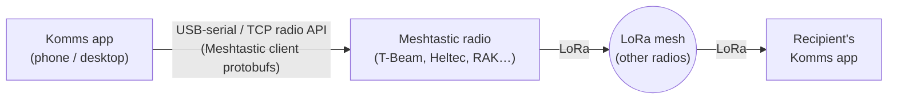

# 05: Transports

Komms treats connectivity as hostile and intermittent by default. The same sealed
envelope ([04: Cryptography §5](04-cryptography.md)) travels over every link; transports
are interchangeable carriers with different cost/latency/MTU profiles, and the node uses
several at once.

## 1. The `Transport` trait (contract)

Every transport implementation in `kult-transport` fulfills one contract. The
following trait is an architectural sketch; the checked-in Rust trait is
authoritative (see [09: Implementation Guide](09-implementation-guide.md)):

```rust
#[async_trait]
pub trait Transport: Send + Sync {
    fn profile(&self) -> LinkProfile;          // mtu, latency class, cost class, broadcast?
    async fn start(&self, events: EventSink) -> Result<()>;
    async fn reachable(&self, peer: &DeliveryHint) -> Reachability;
    async fn send(&self, peer: &DeliveryHint, envelope: Bytes) -> Result<SendReceipt>;
}
```

Rules every implementation must obey:

1. **Ciphertext only.** A transport never sees plaintext or key material.
2. **No identity leakage.** Transports address peers by `DeliveryHint` (multiaddr, mesh
   node id, mailbox token), never by Komms identity keys.
3. **Link encryption is additive, not load-bearing.** Noise/TLS on the link protects
   against A2/A3 traffic tampering, but all security guarantees hold even over a
   plaintext link: the envelope is self-protecting.
4. **Honest signals.** `SendReceipt` distinguishes *handed to link* from *acknowledged by
   next hop* from nothing; the delivery engine and UI depend on not lying.
5. **Retention is deletion-only.** Envelope v2's hour-aligned
   `retention_until` may shorten queue life but never authorizes a transport to
   extend its configured maximum, infer an exact content deadline, or claim
   physical erasure. Expired envelopes are refused on admission and removed on
   load, check-in, forwarding, and periodic cleanup.

The **transport scheduler** in `kult-node` ranks available transports per recipient by
(reachability, latency class, cost class) and may send duplicates across rungs:
envelopes are idempotent and receivers deduplicate by message id.

## 2. Internet transport: libp2p

| Aspect | Choice |
|---|---|
| Stack | rust-libp2p |
| Link protocols | QUIC (primary), TCP+Noise+Yamux (fallback) |
| Discovery | Kademlia DHT; bootstrap from a *user-editable* list of community nodes + manual peer addresses + rendezvous points shared out-of-band (QR) |
| NAT traversal | AutoNAT + Circuit Relay v2 + DCUtR hole punching |
| Prekey bundles | Signed bundles ([06: Identity & Trust](06-identity-trust.md)) published as DHT records under `H(IK_pub)`; signatures make records self-authenticating regardless of which DHT node serves them |
| Mailbox relays | Ordinary nodes advertising a relay protocol; recipients pick relays and list them (as hints) in their bundle |

Bootstrap deserves emphasis: hardcoded bootstrap nodes are a seizure target (A4), so the
list ships as *defaults, not dependencies*: any reachable peer can bootstrap the DHT, and
two users who exchange a QR code need no bootstrap at all.

**Censorship posture (A3)**: QUIC-on-443 blends adequately against casual blocking. Full
DPI resistance (pluggable obfuscated transports, arti/Tor onion services as a transport)
is milestone M6: tracked, not hand-waved.

### 2.1 Optional post-pairing reachability and native wake

The Hybrid Infrastructure Layer is a proposed convenience adjunct, not another
message transport. [ADR-0018](adr/0018-pairwise-rendezvous.md) lets established
peers store fixed-size encrypted `DeliveryHint` records under rotating pairwise
slots. The DHT remains first-contact discovery, and recipient-selected mailbox
relays remain durable store-and-forward. Rendezvous success alone is not a
`SendReceipt` or F4 capability; `kult-node` must probe the returned hint through
the ordinary transport contract.

[ADR-0019](adr/0019-native-wake-gateway.md) emits a static APNs/FCM tick only
after a direct peer or mailbox acknowledged the sealed envelope. It carries no
envelope or conversation data, and provider acknowledgement never changes
delivery state. Sovereign mode registers with neither service. Private mode
uses Tor or a non-colluding Oblivious HTTP ingress; Standard mode uses direct
HTTPS. Complete failure falls back to the unchanged transports in this document.

### 2.2 Ephemeral retention at intermediaries

C4 mailbox, bridge, queue, and fragment records preserve envelope v2's coarse
retention bucket end to end. Every store applies the earlier of its ordinary
maximum TTL and that bucket. A restart re-evaluates absolute Unix time before
returning or forwarding a row; a fragment may never outlive its parent
envelope. The receiver verifies the same bucket inside the authenticated
content, because relays can delete but cannot authenticate a sender or safely
rewrite the hint. Exact endpoint semantics and limitations are in
[19: Disappearing Messages and View-Once Attachments](19-ephemeral-messages.md).

### 2.3 Direct-QUIC live audio

C7 calls use a separate `/komms/call/1` reliable ordered substream only after
the transport has observed a fresh direct `/quic-v1` connection to the exact
peer. TCP/Yamux and Circuit Relay connectivity remain valid for ordinary
messages but do not qualify as `realtime`; DCUtR must complete a direct upgrade
first. Mailbox, sneakernet, BLE, and Meshtastic carriers never receive call
media or a queued call fallback.

Call setup itself is bounded content-v1 data inside the ordinary pairwise
ratchet, so no cleartext call protocol is visible to a relay. The media stream
starts with an authenticated call/device hello and carries bounded
sequence/timestamp/key-phase records under fresh directional keys. Unsent audio
and jitter queues have fixed frame/age caps. See
[23: Live Audio Calls](23-live-audio-calls.md) and
[ADR-0013](adr/0013-real-time-calls.md).

## 3. Proximity transports

- **mDNS/LAN**: automatic discovery and direct QUIC on shared Wi-Fi. Covers the
  "internet is down but the building network works" case and makes local testing trivial.
  Implemented (M3) as a small in-tree responder speaking the libp2p mDNS discovery
  profile; `libp2p-mdns` itself is refused for its RUSTSEC-flagged DNS dependency
  (ADR-0008). Discovered peers seed the Kademlia routing table, so a LAN-only site runs
  the *whole* discovery plane (prekey publish/lookup, contact-by-address) with zero
  bootstrap peers; announcements carry only the transport pseudonym and listen
  addresses (rule 2 above), and honoring rule 3, sealed envelopes need nothing more
  from the link. Off by default in the library (`TransportOptions::lan_discovery`),
  on by default in `kultd` (`--no-mdns` opts out).
- **BLE direct (planned)**: phone-to-phone exchange without any infrastructure,
  chunked over GATT (effective MTU ~180–500 B → uses the fragmentation layer,
  §4). The current mobile shells do not yet ship this carrier.
- **Wi-Fi Aware / Direct**: roadmap (M6); higher bandwidth than BLE where OS support
  allows.

## 4. Off-grid transport: Meshtastic bridge

The flagship fallback: when networks are shut down, envelopes ride LoRa.

### 4.1 Integration model



- The Meshtastic client API is standardized over BLE, serial, and TCP. The
  shipped Komms carrier attaches over USB-serial or the radio's TCP API to a
  stock Meshtastic device: **no custom firmware required**. Owning any supported
  ~30€ board is the only hardware requirement.
- Komms envelopes are carried as Meshtastic packets on a **dedicated private app
  port** (`PortNum` from the private range), so Komms traffic coexists with normal
  Meshtastic use.
- Meshtastic's own channel encryption (AES) is treated as an untrusted outer wrapper:
  nice against casual observers, irrelevant to our security claims. All guarantees come
  from the sealed envelope inside.

### 4.2 Fitting envelopes into LoRa frames

Constraints: usable Meshtastic payload is **233 bytes** per packet (the
protobuf-pinned `Data.payload` cap; the bridge reads the radio's config at runtime
for the airtime math: region and modem preset change how *expensive* a frame is,
not how big it can be); airtime is duty-cycle-limited (EU868: 1–10 % per sub-band);
bandwidth is tens of bytes/second at long-range presets.

Consequences, all normative:

1. **Fragmentation**: envelopes above the frame budget split into type-`0x04` fragments
   ([04: Cryptography §5](04-cryptography.md)); a padded 192 B-bucket text message =
   **≤ 2 LoRa frames**. Reassembly window: 24 h, per-peer cap, fail-closed on overflow.
2. **Selective retransmission**: receiver NACKs missing fragment indices (in a receipt
   envelope) rather than the sender re-flooding whole messages: airtime is the scarcest
   resource in the system.
3. **Priority classes**: text > receipts > prekey/handshake > media. Media over LoRa is
   refused above 4 KiB with honest UI feedback ("will send when a faster link exists")
   rather than silently hogging the mesh.
4. **Addressing**: mesh delivery uses the current **delivery token** (§7 of the crypto
   spec) as the filter: radios/nodes flood within normal Meshtastic routing; Komms
   nodes pick up envelopes whose tokens they recognize. No identity appears on air.
5. **Bridging**: any Komms node attached to both the mesh and the internet acts as a
   store-and-forward bridge in both directions: a village with one Starlink terminal
   gives the whole mesh asynchronous global reach. Implemented (M4) as token-blind
   transit forwarding (ADR-0009): the bridge claims traffic by delivery token like any
   recipient and forwards what it cannot claim: mesh-heard envelopes as mailbox
   deposits toward its relay set, internet-side deposits for unregistered tokens as
   bounded LoRa floods, deduplicated, split-horizon, capped on every axis, and always
   behind the bridge's own traffic in the airtime queue.

### 4.3 Radio-layer honesty

Per the threat model (§4.3): LoRa transmissions are physically observable and
direction-findable. The mesh hides content and conversation structure, not the fact of
transmission. The UI must surface this ("mesh mode is observable radio"): sovereignty
includes knowing your exposure.

## 5. Sneakernet: delay-tolerant bundles

The zero-RF, zero-network fallback and the simplest transport to implement:

- Any set of queued envelopes exports as a **bundle file** (`.kkb`): magic, version, then
  concatenated envelopes: already sealed, already padded; the bundle adds no metadata.
- Carried by USB stick, SD card, or any file channel; imported bundles feed the normal
  receive path (dedup makes double-import harmless). Bundles are also relay-able by
  people who can't read them: a courier learns only bundle size.
- Animated QR sequences for small bundle transfer remain planned. Current QR
  flows exchange pairing/prekey material; shipped message sneakernet uses `.kkb`
  files.

## 6. Transport comparison

| Transport | MTU | Latency | Reach | Infrastructure needed | Milestone |
|---|---|---|---|---|---|
| libp2p QUIC/TCP | ~64 KiB practical | ms–s | Global | Internet access | M3 |
| mDNS/LAN | ~64 KiB | ms | Site | Shared LAN | M3 |
| BLE direct | ~0.2–0.5 KiB/frame | s | ~10–100 m | None | Planned (M6) |
| Meshtastic/LoRa | ~0.2 KiB/frame | s–hours | km–100 km (multi-hop) | ~30€ radio per user | M4 |
| Sneakernet file / animated QR | Unbounded / ~2 KiB target | Human-scale | Anywhere humans go | None | M2 files shipped; animated QR planned |
