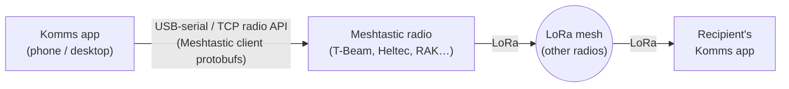

# 05: Transports

Komms treats connectivity as hostile and intermittent by default. The same sealed
envelope ([04: Cryptography §5](04-cryptography.md)) travels over every link; transports
are interchangeable carriers with different cost/latency/MTU profiles, and the node uses
several at once.

## 1. The `Transport` trait (contract)

Every transport implementation in `kult-transport` fulfills one contract. The
following trait is an architectural sketch; the checked-in Rust trait is
authoritative (see [09: Implementation Guide](09-implementation-guide.md)):

```rust
#[async_trait]
pub trait Transport: Send + Sync {
    fn profile(&self) -> LinkProfile;          // mtu, latency class, cost class, broadcast?
    async fn start(&self, events: EventSink) -> Result<()>;
    async fn reachable(&self, peer: &DeliveryHint) -> Reachability;
    async fn send(&self, peer: &DeliveryHint, envelope: Bytes) -> Result<SendReceipt>;
}
```

Rules every implementation must obey:

1. **Ciphertext only.** A transport never sees plaintext or key material.
2. **No Komms identity in transport addressing.** Transports address peers by
   `DeliveryHint` (multiaddr, mesh node id, mailbox token), never by Komms
   identity keys. The link or its operator may still observe network addresses,
   libp2p PeerIds, multiaddrs, opaque tokens, timing, sizes, and volume.
3. **Link encryption is additive, not load-bearing.** Noise/TLS on the link protects
   against A2/A3 traffic tampering, but all security guarantees hold even over a
   plaintext link: the envelope is self-protecting.
4. **Honest signals.** `SendReceipt` distinguishes *handed to link* from *acknowledged by
   next hop* from nothing; the delivery engine and UI depend on not lying.
5. **Retention is deletion-only.** Envelope v2's hour-aligned
   `retention_until` may shorten queue life but never authorizes a transport to
   extend its configured maximum, infer an exact content deadline, or claim
   physical erasure. Expired envelopes are refused on admission and removed on
   load, check-in, forwarding, and periodic cleanup.

The **transport scheduler** in `kult-node` ranks available transports per recipient by
(reachability, latency class, cost class) and may send duplicates across rungs:
envelopes are idempotent and receivers deduplicate by message id.

Foreground user work has its own durable lane. Calls and freshly submitted
messages run before maintenance traffic and older retries. A delivery gets
three short foreground attempts; if the peer remains unreachable, the sealed
envelope moves to a passive cadence (at least 15 minutes, increasing to one
hour) while the unlocked app continues serving new actions immediately.
Transport handoff advances the visible state to `sent` but does not discard a
message envelope: the exact ciphertext remains in the passive lane until its
encrypted end-to-end receipt returns. Receivers remember the authenticated
return route for accepted content ids, so an exact duplicate replays a lost
receipt without duplicating message history. After 30 days without that
receipt, the queue copy is removed and retained history becomes
`delivery failed after 30 days`.

## 2. Internet transport: libp2p

| Aspect | Choice |
|---|---|
| Stack | rust-libp2p |
| Link protocols | QUIC (primary), TCP+Noise+Yamux (fallback) |
| Discovery | Kademlia DHT; bootstrap from a *user-editable* list of community nodes + manual peer addresses + rendezvous points shared out-of-band (QR) |
| NAT traversal | AutoNAT + Circuit Relay v2 + DCUtR hole punching |
| Prekey bundles | Current Alpha: fixed 1,179,648-byte encrypted [ADR-0031](adr/0031-capability-scoped-dht-discovery.md) records under weekly Connect-capability locators. Each record contains a complete ADR-0026 proof, at most two device bundles, at most three introduction routes, and a complete active-device signature. Standard and Private records are mailbox-only. |
| Mailbox relays | Ordinary nodes advertising a relay protocol; recipients pick relays and list them (as hints) in their bundle |

Bootstrap deserves emphasis: a fresh internet-only install still needs one
reachable bootstrap peer or explicit hint to join the DHT. The current Alpha
ships with no default bootstrap peers, so internet discovery requires deliberate
configuration. Any future default nodes would be censorship points for the
first attempt and must therefore remain user-editable and replaceable rather
than becoming a protocol dependency. Any reachable peer can bootstrap the DHT,
and two users who exchange a QR code need no project bootstrap at all. Before
stable, release tests must blackhole every configured default and exercise an
alternate peer and an out-of-band path.

First contact normally uses a `kc2` Connect code: the stable account digest plus
a random rotatable 32-byte bearer discovery capability and checksum. For local
weekly epoch `e`, publication writes exactly `e-1..=e+4` and lookup requests
only `e-1`, `e`, and `e+1`. The locator and XChaCha20-Poly1305 record key use
separate derivations. One locator retains at most eight distinct exact-size
candidates before decryption; valid records are selected deterministically
after full authority, certificate, prekey, admission, time, locator, padding,
and signature verification. Invalid-candidate crowding or an authority
fork/recovery conflict makes discovery unavailable instead of selecting
attacker-controlled state.

The random capability is included only in sealed local state, authenticated
owned-device sync, and current encrypted recovery. A holder can poll the
records, so public sharing makes the account publicly reachable and is not an
anonymity promise. Rotation does not change the account fingerprint or safety
number. Existing Alpha profiles may temporarily dual-publish a mailbox-only
`/kk/prekeys/1` record; new profiles use `/kk/prekeys/2` only, and no legacy
record discloses the new capability. Paired contacts receive updates through
the authenticated ratchet, and ordinary delivery never falls back to public
identity-indexed lookup.

Direct QR/link/file pairing uses a signed `KPB2` wrapper around the
authority-bound device prekey. It carries the current Connect capability and
generation so a new-profile recipient can pre-register the corresponding
device/day introduction token at a selected mailbox. Raw legacy pairing
bundles do not silently recover identity-derived reachability.

Direct sealed-envelope delivery negotiates `/komms/envelope/2`. One encoded
envelope is capped at **128 KiB** across carriers. The receiver keeps at most
256 unsolicited direct envelopes and 8 MiB of their encoded bytes between
delivery-engine drains as a bounded prefilter, but keeps the interactive
response open until the node has completed its admission decision. Its
response has only two meanings:

- `accepted`: the node fully consumed the envelope or transactionally staged
  that exact envelope in bounded durable state;
- `refused`: the request was understood but the next hop did not durably
  retain or consume it.

A timeout, dial error, malformed response, or response-write failure is neither
answer and never becomes an acknowledgement. The sender keeps the durable
envelope retryable and may try another supported path. Version 2 deliberately
does not negotiate the older `/komms/envelope/1` unit response, which could not
distinguish retention from refusal; Alpha peers must be upgraded together.
Embeddings without a durable receive boundary may still read the copy through
the ordinary transport API, but that path returns `refused`; only the staged
receive/settlement API can claim custody.
The response is still only a next-hop custody result: it is not a delivery,
read, or end-to-end receipt. Unknown introductions are checked against the
signed admission descriptor, invitation or puzzle proof, carrier/work budgets,
exact-bundle binding, size, expiry, and replay state before KEM work where
possible. Invalid, expired, under-difficulty, oversized, duplicate, and
over-budget introductions receive the same bounded refusal shape and never
enter the generic pending domain. A valid stranger is atomically sealed into
the fixed provisional request domain rather than contacts or normal history.
These controls implement the local and direct-carrier boundary in
[ADR-0030](adr/0030-first-contact-admission.md). Durable mailbox-v2 custody is
implemented under [ADR-0032](adr/0032-leased-mailbox-delivery.md);
operator-level abuse, capacity, upgrade, and real-network qualification remain
separate open gates.

An internet-to-mesh bridge may copy an unregistered deposit into its bounded
transit queue, but that volatile handoff returns `refused`. Best-effort
forwarding therefore never earns next-hop custody: the sender retains its
durable ciphertext and retry responsibility unless a registered durable
mailbox or endpoint has accepted it.

The libp2p swarm also caps pending inbound/outbound connections at 32 each,
established inbound connections at 64, established connections at 96 total,
and connections per peer at 8. Envelope and mailbox protocols independently
cap active streams per connection. These are memory/concurrency containment,
not first-contact rate limits or Sybil resistance.

Non-introduction envelopes with no currently consumable token enter an
encrypted deferred inbox only when their exact content id is not already
present. The store ceiling is 2,048 envelopes and 64 MiB of sealed rows, with
the older of exact multipath duplicates retained under one stable row id.
Reaching that ceiling prevents persistence and the held direct response is
`refused`. Delayed carriers preserve their ingress class in the sealed row so a
later admission pass applies the correct per-carrier budget after restart.

`/komms/mailbox/2` accepts a deposit only after a `synchronous=FULL` SQLite
transaction commits its row-bound sealed record. Collection creates or
retransmits one 120-second idempotent lease of at most 128 rows / 1 MiB. Each
row has a random relay id. The endpoint first commits the complete encoded
envelope through the typed `PendingStage` plan, then acknowledges the exact
lease and accepted row ids. The relay deletes only those rows in one
transaction. Lost responses, process stops, duplicate pages, duplicate
acknowledgements, partial local capacity, or expired leases therefore leave
unacknowledged rows retryable.

One check-in carries at most 4,096 token filters. Each lifecycle interval
selects at most eight configured mailboxes, requests one page from each, and
admits at most 1,024 rows / 8 MiB into an independently bounded collection
inbox. Mailbox and token cursors rotate; success and failure use jittered
backoff capped at one hour. The command queue, pending outbound work, request
and response bytes, streams, relay quotas, registration/lease lifetimes, and
endpoint pending store are all separately bounded. No collection path loops
until a relay returns empty.

Current clients and `kultd` use v2 only. Destructive `/komms/mailbox/1` serving
is disabled by default and available only through an explicit library
compatibility switch; there is no automatic client fallback. Its
delete-before-response risk prevents any stable custody claim.

**Censorship posture (A3)**: QUIC-on-443 blends adequately against casual blocking. Full
DPI resistance (pluggable obfuscated transports, arti/Tor onion services as a transport)
is milestone M6: tracked, not hand-waved.

### 2.1 Optional post-pairing reachability and native wake

The Hybrid Infrastructure Layer is a reversible convenience adjunct, not
another message transport. The ADR-0018 Alpha implementation lets established
peers store fixed-size encrypted `DeliveryHint` records under rotating
provider-, direction-, and epoch-separated pairwise slots. Capability-scoped
DHT records remain first-contact discovery, and recipient-selected mailbox
relays remain durable store-and-forward. Rendezvous service processing or
self-lookup confirmation is not a `SendReceipt` or F4 capability; `kult-node`
probes the returned source-scoped hint through the ordinary transport contract.
The dedicated two-role reference-service artifact is deployable, but no default
provider or running network service ships.

[ADR-0019](adr/0019-native-wake-gateway.md) emits a static APNs/FCM tick only
after a direct peer or mailbox acknowledged the sealed envelope. It carries no
envelope or conversation data, and provider acknowledgement never changes
delivery state. Sovereign mode registers with neither service. Private mode
uses Tor or a non-colluding Oblivious HTTP ingress; Standard mode uses direct
HTTPS. The Alpha gateway/core implementation has fixed codecs, pinned clients,
sealed per-session capabilities, durable identity-free revoke retries, bounded
generic collection, a dedicated service binary, and hardened deployment
artifacts. Native mobile token/background integration and physical
qualification remain open. Complete failure falls back to the unchanged
transports in this document. See the
[native-wake runbook](37-native-wake-operations.md).

[ADR-0034](adr/0034-operator-minimized-reference-discovery.md) defines the
validated but undeployed Standard-mode bootstrap/DHT cache and post-pairing
rendezvous profile with RAM-backed mutable state. It is not a mailbox or wake
gateway and cannot claim zero metadata, Private-mode non-collusion, or plural
operation.

### 2.2 Ephemeral retention at intermediaries

C4 mailbox, bridge, queue, and fragment records preserve envelope v2's coarse
retention bucket end to end. Every store applies the earlier of its ordinary
maximum TTL and that bucket. A restart re-evaluates absolute Unix time before
returning or forwarding a row; a fragment may never outlive its parent
envelope. The receiver verifies the same bucket inside the authenticated
content, because relays can delete but cannot authenticate a sender or safely
rewrite the hint. Exact endpoint semantics and limitations are in
[19: Disappearing Messages and View-Once Attachments](19-ephemeral-messages.md).

### 2.3 Direct-QUIC live audio

C7 calls use a separate `/komms/call/1` reliable ordered substream only after
the transport has observed a fresh direct `/quic-v1` connection to the exact
peer. TCP/Yamux and Circuit Relay connectivity remain valid for ordinary
messages but do not qualify as `realtime`; DCUtR must complete a direct upgrade
first. Mailbox, sneakernet, BLE, and Meshtastic carriers never receive call
media or a queued call fallback.

Call setup itself is bounded content-v1 data inside the ordinary pairwise
ratchet, so no cleartext call protocol is visible to a relay. The media stream
starts with an authenticated call/device hello and carries bounded
sequence/timestamp/key-phase records under fresh directional keys. Unsent audio
and jitter queues have fixed frame/age caps. See
[23: Live Audio Calls](23-live-audio-calls.md) and
[ADR-0013](adr/0013-real-time-calls.md).

### 2.4 Optional Freenet carrier (proposed)

[ADR-0025](adr/0025-optional-freenet-carrier.md) proposes a desktop-first
experimental carrier over local Freenet Core. It uses per-sending-device,
per-receiving-device, per-direction, epoch-scoped contracts containing only
bounded padded sealed envelopes. It is disabled by default, does not replace
the DHT or QR first-contact paths, and treats a Freenet update acknowledgement
only as next-hop evidence; the existing encrypted receipt remains the sole
transition to `delivered`.

The proposal deliberately makes no anonymity, remote-erasure, mobile-readiness,
or high-threat claim. Contract activity, timing, padded sizes, volume, and
network participation may remain observable. Freenet failure must preserve the
durable queue and fall back to the unchanged direct, mailbox, LAN, mesh, and
sneakernet paths. Live-call media never uses this carrier.

## 3. Proximity transports

- **mDNS/LAN**: automatic discovery and direct QUIC on shared Wi-Fi. Covers the
  "internet is down but the building network works" case and makes local testing trivial.
  Implemented (M3) as a small in-tree responder speaking the libp2p mDNS discovery
  profile; `libp2p-mdns` itself is refused for its RUSTSEC-flagged DNS dependency
  (ADR-0008). Discovered peers seed the Kademlia routing table, so a LAN-only site runs
  the *whole* discovery plane (prekey publish/lookup, contact-by-address) with zero
  bootstrap peers; announcements carry only the transport pseudonym and listen
  addresses (rule 2 above), and honoring rule 3, sealed envelopes need nothing more
  from the link. Off by default in the library (`TransportOptions::lan_discovery`),
  on by default in `kultd` (`--no-mdns` opts out).
- **BLE direct (planned)**: phone-to-phone exchange without any infrastructure,
  chunked over GATT (effective MTU ~180–500 B → uses the fragmentation layer,
  §4). The current mobile shells do not yet ship this carrier.
- **Wi-Fi Aware / Direct**: roadmap (M6); higher bandwidth than BLE where OS support
  allows.

## 4. Off-grid transport: Meshtastic bridge

The flagship fallback: when networks are shut down, envelopes ride LoRa.

### 4.1 Integration model


```mermaid
flowchart LR
    App["Komms app<br/>(phone / desktop)"]
    Radio["Meshtastic radio<br/>(T-Beam, Heltec, RAK…)"]
    Mesh(("LoRa mesh<br/>(other radios)"))
    Peer["Recipient's<br/>Komms app"]
    App -- "USB-serial / TCP radio API<br/>(Meshtastic client protobufs)" --> Radio
    Radio -- "LoRa" --> Mesh -- "LoRa" --> Peer
```

- The Meshtastic client API is standardized over BLE, serial, and TCP. The
  implemented Komms carrier attaches over USB-serial or the radio's TCP API to a
  stock Meshtastic device: **no custom firmware required**. Owning any supported
  ~30€ board is the only hardware requirement.
- Komms envelopes are carried as Meshtastic packets on a **dedicated private app
  port** (`PortNum` from the private range), so Komms traffic coexists with normal
  Meshtastic use.
- Meshtastic's own channel encryption (AES) is treated as an untrusted outer wrapper:
  nice against casual observers, irrelevant to our security claims. All guarantees come
  from the sealed envelope inside.

### 4.2 Fitting envelopes into LoRa frames

Constraints: usable Meshtastic payload is **233 bytes** per packet (the
protobuf-pinned `Data.payload` cap; the bridge reads the radio's config at runtime
for the airtime math: region and modem preset change how *expensive* a frame is,
not how big it can be); airtime is duty-cycle-limited (EU868: 1–10 % per sub-band);
bandwidth is tens of bytes/second at long-range presets.

Consequences, all normative:

1. **Fragmentation**: envelopes above the frame budget split into type-`0x04` fragments
   ([04: Cryptography §5](04-cryptography.md)); a padded 192 B-bucket text message =
   **≤ 2 LoRa frames**. Reassembly window: 24 h, 1,024 fragments per envelope,
   256 concurrent partials, fail-closed on overflow. One receipt requests at
   most 4,096 missing indices across 32 partials so hostile fragment metadata
   cannot create an oversized NACK. Outer fragments are not made permanently
   seen before their completed inner envelope clears bounded admission, so a
   sender's full retry remains recoverable when the deferred inbox was full.
2. **Selective retransmission**: receiver NACKs missing fragment indices (in a receipt
   envelope) rather than the sender re-flooding whole messages: airtime is the scarcest
   resource in the system.
3. **Priority classes**: realtime > fresh user messages > maintenance >
   passive message retries > media. Within a lane, text > receipts >
   prekey/handshake. Media over LoRa is refused above 4 KiB with honest UI
   feedback ("will send when a faster link exists") rather than silently
   hogging the mesh.
4. **Addressing**: mesh delivery uses the current **delivery token** (§7 of the crypto
   spec) as the filter: radios/nodes flood within normal Meshtastic routing; Komms
   nodes pick up envelopes whose tokens they recognize. No identity appears on air.
5. **Bridging**: any Komms node attached to both the mesh and the internet acts as a
   store-and-forward bridge in both directions: a village with one Starlink terminal
   gives the whole mesh asynchronous global reach. Implemented (M4) as token-blind
   transit forwarding (ADR-0009): the bridge claims traffic by delivery token like any
   recipient and forwards what it cannot claim: mesh-heard envelopes as mailbox
   deposits toward its relay set, internet-side deposits for unregistered tokens as
   bounded LoRa floods, deduplicated, split-horizon, capped on every axis, and always
   behind the bridge's own traffic in the airtime queue.

### 4.3 Radio-layer honesty

Per the threat model (§4.3): LoRa transmissions are physically observable and
direction-findable. The mesh hides content and conversation structure, not the fact of
transmission. The UI must surface this ("mesh mode is observable radio"): sovereignty
includes knowing your exposure.

## 5. Sneakernet: delay-tolerant bundles

The zero-RF, zero-network fallback and the simplest transport to implement:

- Up to 4,096 queued envelopes and 16 MiB export as a **bundle file** (`.kkb`):
  magic, version, then concatenated envelopes: already sealed, already padded;
  the bundle format adds no identity or routing fields. The filesystem or
  courier channel may still expose filename, size, timestamps, handling, and
  location. Each envelope retains the canonical 128 KiB limit.
- Carried by USB stick, SD card, or any file channel; imported bundles feed the normal
  receive path (dedup makes double-import harmless). Bundles are also relay-able by
  people who can't read them: a courier learns only bundle size. One receive
  pass scans at most 1,024 candidate directory entries, processes at most 256
  regular bundle files and 16 MiB, and leaves remaining work for the next pass.
  Oversized files and non-regular `.kkb` entries are moved out of the candidate
  namespace so they cannot starve valid bundles.
- Animated QR sequences for **message** bundle transfer remain planned.
  Pairing already uses a bounded animated sequence because the ML-KEM-768
  public key makes a complete post-quantum prekey bundle too dense for one
  reliably scanned symbol; implemented message sneakernet uses `.kkb` files.

## 6. Transport comparison

| Transport | MTU | Latency | Reach | Infrastructure needed | Milestone |
|---|---|---|---|---|---|
| libp2p QUIC/TCP | 128 KiB/envelope | ms–s | Global | Internet access | M3 |
| Freenet contracts | Prototype must measure | seconds–offline | Global store-and-forward | Local Freenet Core; explicit opt-in | Proposed (M6, ADR-0025) |
| mDNS/LAN | 128 KiB/envelope | ms | Site | Shared LAN | M3 |
| BLE direct | ~0.2–0.5 KiB/frame | s | ~10–100 m | None | Planned (M6) |
| Meshtastic/LoRa | ~0.2 KiB/frame | s–hours | km–100 km (multi-hop) | ~30€ radio per user | M4 |
| Sneakernet file / animated QR | 128 KiB/envelope; 16 MiB bundle / ~2 KiB target | Human-scale | Anywhere humans go | None | M2 files implemented; animated QR planned |
